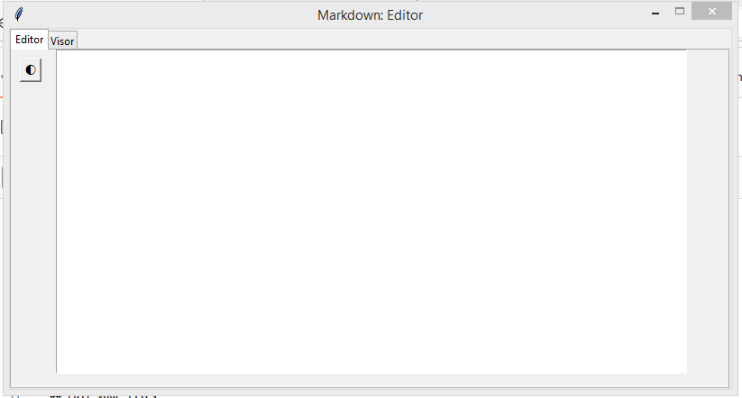

# MarkUP

  
  
  

 

### A Simple Markdown editor cross-platform and open source

Created on **Python/Tkinter**

## Edit your files
Create all kinds of **Markdown** files and view them within **MarkUP**, this can help in various testing occasions to inform users of something

- **Create a MD File**
- **View MD Files**
- **Edit a MD File**

## Screenshots

